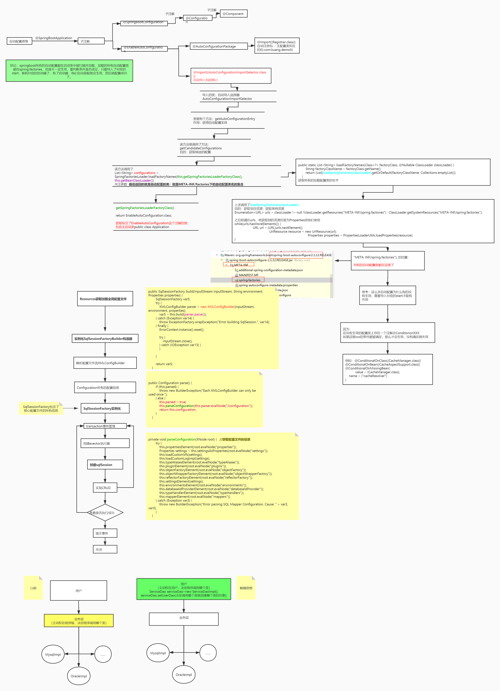

# SpringBoot常见面试题

## SpringBoot的核心特性有哪些?

**（什么是SpringBoot）**

Spring Boot 是基于 Spring 框架的项目，旨在简化 Spring 应用的开发和部署。它通过约定优于配置的理念，减少了繁琐的配置。

**自动配置（Auto-Configuration）**:
Spring Boot 能够根据项目中的依赖和配置自动配置 Spring 应用程序，开发者无需手动配置大部分 Spring 组件。比如Spring Boot 会自动配置数据源、自动配置 Spring MVC、嵌入式的 Tomcat 服务器等。

**内嵌服务器（Embedded Server）**:
Spring Boot 提供了内嵌的服务器（如 Tomcat、Jetty），可以直接将应用打包成可执行的 JAR 文件，运行时无需外部应用服务器。这使得应用程序的部署更加简单灵活。

**起步依赖（Starter Dependencies）**:
Spring Boot 提供了一系列起步依赖（Starter），这些起步依赖是经过精心配置的 Maven 或 Gradle 依赖集合，旨在帮助开发者快速引入和配置常见功能模块。例如，`spring-boot-starter-web` 包含了构建 Web 应用所需的所有依赖。

**简化的配置管理（Simplified Configuration Management）**:
Spring Boot 支持通过 `application.properties` 或 `application.yml` 文件进行配置管理，并支持通过命令行参数、环境变量等方式动态配置，且支持配置文件的多环境管理。

**强大的社区支持和文档**:
Spring Boot 拥有广泛的社区支持和详细的官方文档，提供了丰富的教程、示例项目以及第三方集成支持。

##SpringBoot是如何通过main方法启动web项目的?

**（SpringBoot的启动流程）**

总：SpringBoot启动，其本质就是加载各种配置信息，然后初始化loc容器并返回
在其启动的过程中会做这么几个事情

分：首先，当我们在启动类执行SpringApplication.run这行代码的时候，在它的方法内部其实会做两个事情

1. 创建SpringApplication对象；

2. 执行run方法。

   其次，在创建SpringApplication对象的时候，在它的构造方法内部主要做3个事情。
   **1.确认web应用类型，一般情况下是Servlet类型，这种类型的应用，将来会自动启动一个tomcat**
   **2.从spring.factories配置文件中，加载默认的ApplicationContextlnitializer和ApplicationListener**
   **3.记录当前应用的主启动类，将来做包扫描使用**
   最后，对象创建好了以后，再调用该对象的run方法，在run方法的内部主要做4个事情
   **1.准备Environment对象，它里面会封装一些当前应用运行环境的参数，比如环境变量等等**
   **2.实例化容器，这里仅仅是创建ApplicationContext对象**
   **3.容器创建好了以后，会为容器做一些准备工作，比如为容器设置Environment、BeanFactoryPostProcessor后置处理**
   **器，并且加载主类对应的Definition**
   **4.刷新容器，就是我们常说的referesh，在这里会真正的创建Bean实例**

   ​

   总：总结一下我刚说的，其实SpringBoot启动的时候核心就两步，创建SpringApplication对象以及run方法的调用，在run方法中会
   真正的实例化容器，并创建容器中需要的Bean实例，最终返回。

## Spring Boot 的核心注解是哪个？它主要由哪几个注解组成的？

启动类上面的注解是@SpringBootApplication，它也是 Spring Boot 的核心注解，主要组合包含了以下 3 个注解：

@SpringBootConfiguration：组合了 @Configuration 注解，实现配置文件的功能。

@EnableAutoConfiguration：打开自动配置的功能。

@ComponentScan：Spring组件扫描。

## @SpringBootApplication注解的作用是什么

`@SpringBootApplication` 是一个复合注解，是 Spring Boot 应用的入口注解，主要由三个核心注解组成：

**@SpringBootConfiguration**：

- 这是一个特殊的 `@Configuration` 注解，标识当前类是 Spring 的配置类（即可以用来定义 `@Bean` 方法）。它的作用类似于 Spring 的传统 `@Configuration` 注解，表示该类可以提供 Spring 容器的配置。

**@EnableAutoConfiguration**：

- 启用 Spring Boot 的自动配置功能。它会告诉 Spring Boot 根据类路径中的依赖、配置文件中的设置，自动配置 Spring 应用所需的各种 Bean。例如，如果类路径中存在 `spring-boot-starter-web`，它会自动配置与 Web 应用相关的 Bean，如 `DispatcherServlet`、嵌入式 Tomcat 服务器等。
- `@EnableAutoConfiguration` 会扫描 `META-INF/spring.factories` 文件，并加载配置的自动配置类。这是 Spring Boot 自动配置的核心所在。

**@ComponentScan**：

- 该注解会告诉 Spring 容器扫描指定包及其子包中的所有 `@Component`、`@Service`、`@Repository`、`@Controller` 等注解的类，并将它们注册为 Spring Bean。默认情况下，它会扫描标注了 `@SpringBootApplication` 的主类所在的包及其子包。

##SpringBoot的自动配置原理

Spring Boot 的自动配置是通过 `@EnableAutoConfiguration` 注解结合 `spring.factories` 文件中的自动配置类，在启动时根据条件注解来动态配置应用所需的组件。

## 实现自动配置

1.首先创建自动配置的类，用`@Configuration`标识， 通过 `@Bean` 方法定义需要自动配置的 Spring Bean，并使用条件注解（如 `@ConditionalOnClass`、`@ConditionalOnMissingBean` 等）来控制 Bean 的创建。

2.然后创建 `META-INF/spring.factories` 文件，这个文件用于列出需要自动加载的配置类。`spring.factories` 文件的格式为键值对，其中键是 `org.springframework.boot.autoconfigure.EnableAutoConfiguration`，值是你的自动配置类的全限定名。

总结:实现 Spring Boot 自动配置的关键在于创建自动配置类，使用 `@Configuration` 和条件注解，结合 `spring.factories` 文件将配置类注册到 Spring Boot 自动配置机制中。

## SpringBoot常用注解

**@SpringBootApplication**。这个注解是Spring Boot最核心的注解，用在 Spring Boot的主类上，标识这是一个 Spring Boot 应用。

**@SpringBootConfiguration**：组合了 @Configuration 注解，实现配置文件的功能。

**@EnableAutoConfiguration**：打开自动配置的功能，也可以关闭某个自动配置的选项，如关闭数据源自动配置功能： @SpringBootApplication(exclude = { DataSourceAutoConfiguration.class })。

**@ComponentScan**：Spring组件扫描。

**@RestController**。用于标注控制层组件(如struts中的action)，表示这是个控制器bean,并且是将函数的返回值直 接填入HTTP响应体中,是REST风格的控制器；它是@Controller和@ResponseBody的合集。

**@Service**：一般用于修饰service层的组件

**@Component**。泛指组件，当组件不好归类的时候，我们可以使用这个注解进行标注

**@Bean**，相当于XML中的`<bean></bean>`,放在方法的上面，而不是类，意思是产生一个bean,并交给spring管理。

**@RequestMapping**  RequestMapping是一个用来处理请求地址映射的注解；提供路由信息，负责URL到Controller中的具体函数的映射，可用于类或方法上。用于类上，表示类中的所有响应请求的方法都是以该地址作为父路径。

**@RequestParam** 用在方法的参数前面

@PostConstruct用于修饰方法，当对象实例被创建并且依赖注入完成后执行，可用于对象实例的初始化操作。

**@PreDestroy**用于修饰方法，当对象实例将被Spring容器移除时执行，可用于对象实例持有资源的释放。

**@Transactional**表示方法和类需要开启事务，当作用与类上时，类中所有方法均会开启事务，当作用于方法上时，方法开启事务，方法上的注解无法被子类所继承。

**@ControllerAdvice**常与`@ExceptionHandler`注解一起使用，用于捕获全局异常，能作用于所有controller中

**@ExceptionHandler**修饰方法时，表示该方法为处理全局异常的方法

## 如何理解SpringBoot的starter

**Spring Boot Starter** 是一种特殊的 Maven依赖，它提供了一组常用的依赖和默认配置，旨在简化 Spring Boot 应用的设置和配置。

###  **优点**

- **简化配置**：通过 Starter，开发者可以快速引入一组相关的库和默认配置，减少了手动配置的复杂性。
- **一致性**：提供了一致的依赖和配置，确保应用中的各种组件能够兼容和协同工作。
- **易于使用**：通过集成 Starter，开发者可以专注于业务逻辑，而不是配置和依赖管理。

## SpringBoot打成的jar包和普通的jar包的区别

1.SpringBoot打成的jar包内嵌服务器,而普通的jar包需要依赖外部的服务器。

2.依赖的打包方式不同，Spring Boot 将项目及其所有依赖（包括第三方库和 Spring 框架的依赖）一起打包到一个可执行的 JAR 文件中。这意味着运行 Spring Boot 应用时，只需要一个 JAR 文件即可，不需要在类路径中额外指定依赖。而普通的jar文件通常只包含项目本身(及.class文件和相关资源文件)，要运行该jar文件，需要在类路径中指定额外所需依赖。

## SpringBoot默认同时处理的最大连接数是多少

Spring Boot 本身不设置默认的最大连接数限制，这一限制是由其内嵌的 Web 服务器（如 Tomcat）以及数据库连接池配置决定的。

## 如何在SpringBoot中使用拦截器

1.首先创建一个拦截器的类，让他实现HandlerInterceptor，里面有三个方法，分别是

**preHandle**：在请求处理之前调用。可以用来进行请求预处理，例如用户认证、日志记录等。

**postHandle**：在请求处理之后但在视图渲染之前调用。可以用来修改 Model 数据。

**afterCompletion**：在请求处理完成后调用。可以用来进行清理操作，例如资源释放、日志记录等。

分别实现这三个方法即可。

2.将自定义的拦截器注册到SpringBoot拦截器链中，可以通过实现WebMvcConfigurer接口来完成。并在 `addInterceptors` 方法中添加你的拦截器。

**addPathPatterns**：设置哪些路径会被拦截。可以使用通配符，如 `/**` 表示所有路径。

**excludePathPatterns**：设置哪些路径不会被拦截。可以用来排除某些特定的路径或模式。

## 如何在SpringBoot中定义和读取自定义配置

1.定义配置，在yml文件中定义自定义配置.

2.**使用 @ConfigurationProperties**

`@ConfigurationProperties` 注解允许你将配置属性绑定到一个 POJO 类中，这样可以将配置项组织

也可以使用 `@Value` 注解在 Spring Bean 中注入配置值。

获取配置类信息我一般**使用 Environment**

`Environment` 对象允许你在代码中动态读取配置属性。适合在运行时需要获取配置值的场景。

首先注入Environment，然后调用environment.getProperty()方法。

## SpringBoot如何实现异步处理

1.首先在启动类上添加@EnableAsync

2.然后在需要异步处理的方法上使用@Async来表示

3.调用异步方法并处理返回的 `CompletableFuture`。

