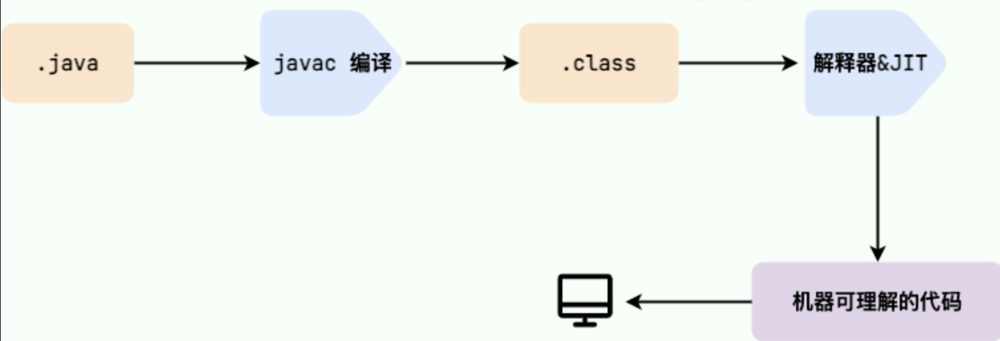
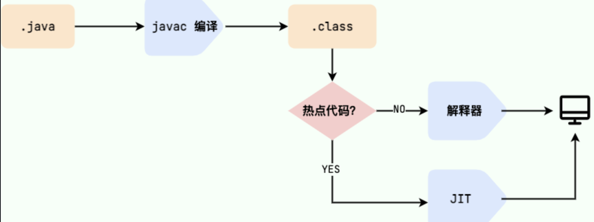
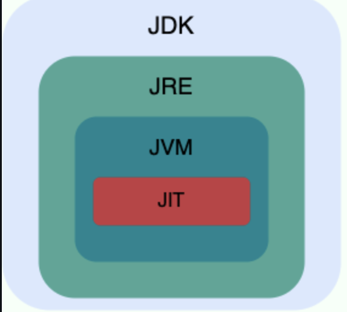
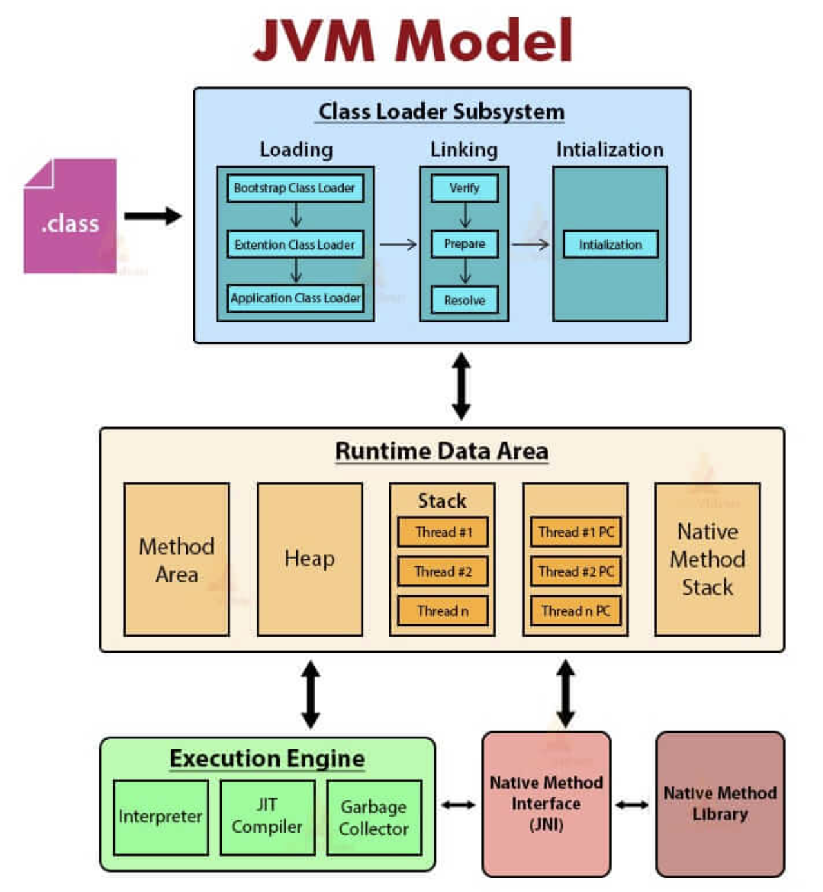
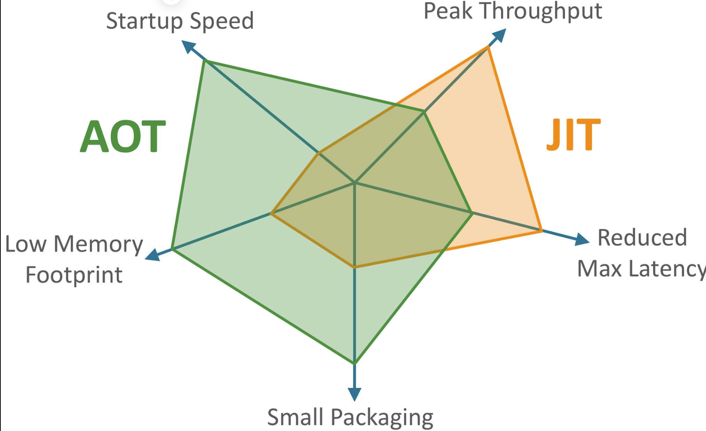
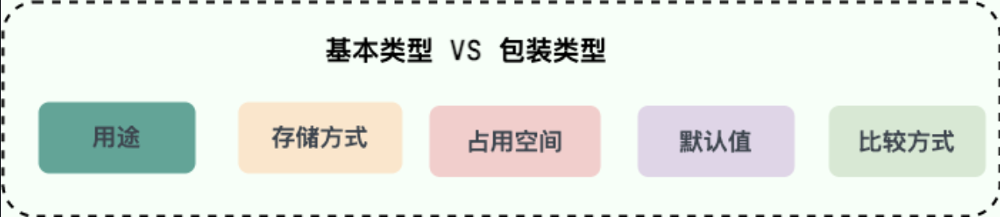
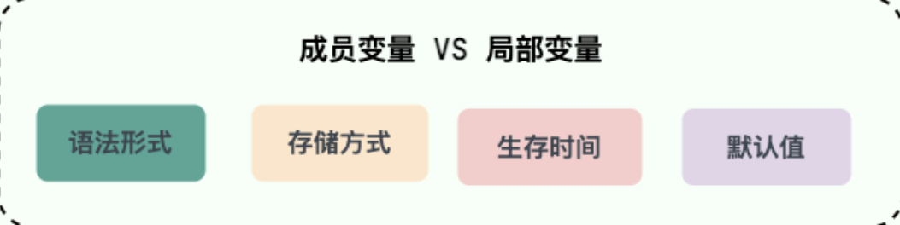
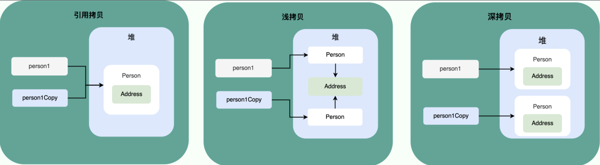

## Java特点

1. 面向对象（封装，继承，多态）；
2. 支持多线程（ C++ 语言没有内置的多线程机制，因此必须调用操作系统的多线程功能来进行多线程程序设计，而 Java 语言却提供了多线程支持）；
3. 可靠性（具备异常处理和自动内存管理机制）；
4. 安全性（Java 语言本身的设计就提供了多重安全防护机制如访问权限修饰符、限制程序直接访问操作系统资源）；
5. 高效性（通过 Just In Time 编译器等技术的优化，Java 语言的运行效率还是非常不错的）；
6. 支持网络编程并且很方便；
7. 编译与解释并存

## JVM vs JDK vs JRE

### JVM 

Java 虚拟机（Java Virtual Machine, JVM）是运行 Java 字节码的虚拟机。JVM 有针对不同系统的特定实现（Windows，Linux，macOS），目的是使用相同的字节码，它们都会给出相同的结果。字节码和不同系统的 JVM 实现是 Java 语言“一次编译，随处可以运行”的关键所在。

### JDK 

JDK（Java Development Kit），它是功能齐全的 Java SDK，是提供给开发者使用，能够创建和编译 Java 程序的开发套件。它包含了 JRE。

### JRE

JRE（Java Runtime Environment） 是 Java 运行时环境。它是运行已编译 Java 程序所需的所有内容的集合，主要包括 Java 虚拟机（JVM）、Java 基础类库（Class Library）。

从 JDK 9 开始，就不需要区分 JDK 和 JRE 的关系了.

## 什么是字节码，采用字节码的好处

JVM能够理解的代码是字节码。(拓展名为.class的文件),它只面向虚拟机。在一定程度上解决解释性语言执行效率低的问题，又保留了可移植的特点。

.class->机器码这一步， JVM 类加载器首先加载字节码文件，然后通过解释器逐行解释执行，这种方式的执行速度会相对比较慢。而且，有些方法和代码块是经常需要被调用的(也就是所谓的热点代码)，所以后面引进了 **JIT（Just in Time Compilation）** 编译器，而 JIT 属于运行时编译。当 JIT 编译器完成第一次编译后，其会将字节码对应的机器码保存下来，下次可以直接使用。

JDK、JRE、JVM、JIT 这四者的关系如下图所示

### JVM Model

## 为什么说Java语言“编译与解释共存？”

首先语言分类：

- **编译型**：[编译型语言](https://zh.wikipedia.org/wiki/%E7%B7%A8%E8%AD%AF%E8%AA%9E%E8%A8%80) 会通过[编译器](https://zh.wikipedia.org/wiki/%E7%B7%A8%E8%AD%AF%E5%99%A8)将源代码一次性翻译成可被该平台执行的机器码。一般情况下，编译语言的执行速度比较快，开发效率比较低。常见的编译性语言有 C、C++、Go、Rust 等等。
- **解释型**：[解释型语言](https://zh.wikipedia.org/wiki/%E7%9B%B4%E8%AD%AF%E8%AA%9E%E8%A8%80)会通过[解释器](https://zh.wikipedia.org/wiki/%E7%9B%B4%E8%AD%AF%E5%99%A8)一句一句的将代码解释（interpret）为机器代码后再执行。解释型语言开发效率比较快，执行速度比较慢。常见的解释性语言有 Python、JavaScript、PHP 等等。

结论：

这是因为 Java 语言既具有编译型语言的特征，也具有解释型语言的特征。因为 Java 程序要经过先编译，后解释两个步骤，由 Java 编写的程序需要先经过编译步骤，生成字节码（`.class` 文件），这种字节码必须由 Java 解释器来解释执行。

## AOT的优缺点

JDK 9 引入了一种新的编译模式 **AOT(Ahead of Time Compilation)** 。和 JIT 不同的是，这种编译模式会在程序被执行前就将其编译成机器码，属于静态编译（C、 C++，Rust，Go 等语言就是静态编译）。AOT 避免了 JIT 预热等各方面的开销，可以提高 Java 程序的启动速度，避免预热时间长。并且，AOT 还能减少内存占用和增强 Java 程序的安全性（AOT 编译后的代码不容易被反编译和修改），特别适合云原生场景。

**JIT 与 AOT 两者的关键指标对比**:

优点：AOT启动时间快、内存占用低和打包体积小。

JIT 的主要优势在于具备更高的极限处理能力，可以降低请求的最大延迟。

缺点：AOT 编译无法支持 Java 的一些动态特性，如反射、动态代理、动态加载、JNI（Java Native Interface）等。然而，很多框架和库（如 Spring）用到了这些特性。如果只使用 AOT 编译，那就没办法使用这些框架和库了。

## Java与C++的区别

1.Java不提供指针访问内存，程序内存更安全。

2.Java的类是单继承，C++支持多重继承。虽然Java类不可以多继承，但接口可以多继承。

3.Java有自动内存管理垃圾回收机制(GC),不需要手动释放无用内存。

## 基本数据类型和包装类型的区别

1.用途：基本类型除了定义常量和局部变量之外很少使用，在其他地方（例如方法参数和对象属性等）都是使用包装类型。

2.存储方式：**基础数据类型的局部变量存放在JVM栈中**的局部变量表中，**成员变量（未被static修饰）存放在JVM的堆**中。而包装类型属于对象类型，几乎所有的对象实例都存放在堆中。

3.占用空间：基础类型占用内存少。

4.默认值：成员变量包装类型不赋值就是null，而基本类型有默认值且不是null。

5.比较方式：基本数据类型比较的上述值，用“ == ” 比较，对于包装类型数据， “ == ” 比较的是对象的内存地址，如果要进行值比较，全部使用equals()方法。

## 包装类型的缓存机制

`Byte`,`Short`,`Integer`,`Long` 这 4 种包装类默认创建了数值 **[-128，127]** 的相应类型的缓存数据，`Character` 创建了数值在 **[0,127]** 范围的缓存数据，`Boolean` 直接返回 `True` or `False`。

**缓存的范围区间的大小只是在性能和资源之间的权衡。**

## 自动拆箱和装箱原理

**什么是自动拆装箱？**

- **装箱**：将基本类型用它们对应的引用类型包装起来；
- **拆箱**：将包装类型转换为基本数据类型
- ​

装箱其实就是调用了 包装类的`valueOf()`方法，拆箱其实就是调用了 `xxxValue()`方法。

频繁的拆装箱会影响系统的性能。

## 浮点数运算为什么会有精度丢失

因为计算机是二进制的，对于无限循环和无限不循环小数来说，存储在计算机中小数会被截断，所以会有精度丢失问题。

## 解决浮点运算的精度丢失问题

使用`BigDecimal` 可以实现对浮点数的运算，不会造成精度丢失。

##  超过long整型的数据如何表示

**可以使用BigInteger 类**。 BigInteger 是Java 提供的一个用于处理任意精度整数的类，它可以表示非常大或非常小的整数.

`BigInteger` 内部使用 `int[]` 数组来存储任意大小的整形数据。

相对于常规整型运算，BigInteger运算的效率会较低。

## 成员变量和局部变量的区别

语法形式：成员变量是属于类的，而局部变量是在代码块或方法中定义的变量，或是方法的参数。成员变量可以被 `public`,`private`,`static` 等修饰符所修饰，而局部变量不能被访问控制修饰符及 `static` 所修饰。成员变量和局部变量都能被 `final` 所修饰。

存储方式：如果成员变量使用static修饰，则这个变量是属于类的，如果没有static修饰，这个成员变量是属于对象实例的，对象存在于堆内存，局部变量存在于栈内存。

生存方式：成员变量是对象的一部分，它随着对象的创建而存在，而局部变量随着方法的调用而自动生成，随着方法的调用结束而消亡。

默认值：成员变量如果没有赋值初始值，则会以该类型的默认值而赋值，局部变量不会自动赋值。

### **为什么成员变量有默认值**

1. 如果没有默认值,变量存储会是内存地址对应的任意随机值，程序读取该值运行会出现意外。

   ​

2. 默认值有两种设置方式：手动和自动，根据第一点，没有手动赋值一定要自
   动赋值。**成员变量在运行时可借助反射等方法手动赋值**，而局部变量不行。

3.对于编译器来说(javac)局部变量没有赋值很好判断，可以直接报错。而成员变量可能会在运行时赋值，无法判断。所以自动采用赋默认值。

## 静态方法为什么不能调用非静态成员

因为静态方法是属于类的，在类被加载的时候就会给静态方法分配内存，可以通过类名直接访问。而非静态成员属于实例对象，只有在实例后才能存在。

在非静态成员不存在的时候，静态方法就存在了，如果此时静态方法调用非静态成员，属于非法操作。

> 静态方法在访问本类的成员时，只允许访问静态成员（即静态成员变量和静态方法），不允许访问实例成员（即实例成员变量和实例方法），而实例方法不存在这个限制。

## Java的堆内存和栈内存

Java把内存划分成两种：一种是堆内存，一种是栈内存。

堆：主要用于存储实例化的对象，数组。由JVM动态分配内存空间。一个JVM只有一个堆内存，线程是可以共享数据的。

(堆用来存储实例化对象)

栈：主要用于存储局部变量和对象的引用变量，每个线程都会有一个独立的栈空间，所以线程之间是不共享数据的。

(栈用来存储变量引用变量(对象引用)和局部变量，基础数据类型的局部变量存放在JVM栈)

### 栈和堆的区别

存储方式：

1.栈和堆的最主要的区别是栈内存存储的是局部变量和方法调用的，堆内存是用来存储实例化的对象的。

线程归属：

2.栈内存归属于单个线程，每一个线程都有一个独立的栈内存，其他线程无法访问其中的变量，而堆内存的变量可以被所有线程访问。

空间大小：

栈内存远远小于堆内存。

## 浅拷贝和深拷贝的区别

浅拷贝会在堆中创建一个新的对象(区别于引用拷贝)，但是如果拷贝的对象内部的属性是一个引用类型的话，浅拷贝会复制内部对象的引用地址，也就是拷贝对象与源对象的共用一个内部对象。

深拷贝会完全复制这个对象，包括源对象的内部对象。

引用拷贝就是两个不同的引用指向同一个对象。

## 为什么要有HashCode

如果没有HashCode，对于一些哈希容器来说，每次向这个容器中添加元素，都要判断一下这个元素是否存在。如果元素很多，就需要进行多次判断，性能很低，所以就有了一种替代的方案hashCode。

当我们向哈希容器添加元素的时候，会先算出这个元素的哈希值，判断这个容器是否存在相同的哈希值，如果不存在，直接返回null,如果存在，再调用当前对象的equals()方法比较一下看哈希处的对象是否和要查找的对象相同；如果不相同，那么返回null。如果相同，则返回该哈希处的对象。

**hashCode()被设计用来使得哈希容器能高效的工作。也只有在哈希容器中，才使用hashCode()来比较对象是否相等，但要注意这种比较是一种弱的比较，还要利用equals()方法最终确认。**

## 为什么String不可变

String类使用由final修饰的字符数组来存储字符串的，而且这个字符数组是私有的，不可被外界访问，并且String类没有提供修改/暴露这个字符串的方法，所以String是不可变的。

还有一点是因为String类也被final修饰，从而String类不可被继承，避免了子类破坏String 的不可变。

