# Java并发


## 线程与进程

进程是程序的一次执行过程，是系统运行程序的基本单位。

而线程与进程相似，但线程是一个比进程更小的执行单位。一个进程在执行的过程中可以产生多个线程。

与进程不同的是**同类的多个线程共享**进程的堆和方法区资源。但每个线程都有自己的程序计数器、虚拟机栈和本地方法栈。

线程称为轻量级的进程。（负担要比进程小得多）


## 简要描述线程与进程的关系、区别及优缺点


上图为Java内存区域，我们从 JVM 的角度来说一下线程和进程之间的关系。


一个进程有多个线程，多个线程共享进程中的堆和方法区资源(元空间)，但每个线程都会有自己的程序计数器、虚拟机栈和本地方法栈。

**线程是进程划分成的更小的运行单位。线程和进程最大的不同在于基本上各进程是独立的，而各线程则不一定，因为同一进程中的线程极有可能会相互影响。线程执行开销小，但不利于资源的管理和保护；而进程正相反。**


为什么程序计数器私有?

程序计数器主要有下面两个作用：

1. 字节码解释器通过改变程序计数器来依次读取指令，从而实现代码的流程控制，如：顺序执行、选择、循环、异常处理。
2. 在多线程的情况下，程序计数器用于记录当前线程执行的位置，从而当线程被切换回来的时候能够知道该线程上次运行到哪儿了。

程序计数器私有主要是为了**线程切换后能恢复到正确的执行位置**。


虚拟机栈和本地方法栈为什么是私有的?

为了**保证线程中的局部变量不被别的线程访问到**


堆和方法区是所有线程共享的资源，其中堆是进程中最大的一块内存，主要用于存放新创建的对象 (几乎所有对象都在这里分配内存)，方法区主要用于存放已被加载的类信息、常量、静态变量、即时编译器编译后的代码等数据。


## 如何创建线程

一般来说，创建线程有很多种方式，例如继承`Thread`类、实现`Runnable`接口、实现`Callable`接口、使用线程池、使用`CompletableFuture`类等等。

不过，这些方式其实并没有真正创建出线程。准确点来说，这些都属于是在 Java 代码中使用多线程的方法。

严格来说，Java 就只有一种方式可以创建线程，那就是通过`new Thread().start()`创建。不管是哪种方式，最终还是依赖于`new Thread().start()`。

详解:https://mp.weixin.qq.com/s/NspUsyhEmKnJ-4OprRFp9g


## 线程的上下文切换


上下文是指线程执行过程中的状态和运行条件。


- 主动让出 CPU，比如调用了 `sleep()`, `wait()` 等。
- 时间片用完，因为操作系统要防止一个线程或者进程长时间占用 CPU 导致其他线程或者进程饿死。
- 调用了阻塞类型的系统中断，比如请求 IO，线程被阻塞。


这三种都会发生线程切换，线程切换意味着需要保存当前线程的上下文，留待线程下次占用 CPU 的时候恢复现场。并加载下一个将要占用 CPU 的线程上下文。这就是所谓的 上下文切换。


## 可以直接调用 Thread 类的 run 方法吗？

new 一个Thread，线程进入了新建状态，调用start()方法，会启动一个线程并使线程进入了就绪状态。当分配到时间片后就可以开始运行了。start()会执行线程的相应准备工作，然后自动执行run()方法的内容。这是真正多线程工作。而直接执行run()方法，会把run()方法当成一个main线程下的普通方法去执行，并不会在某个线程中执行它，所以这不是多线程执行。


**总结：调用start()方法可启动线程并使线程进入就绪状态，直接执行run()方法的话不会以多线程的方式执行。**


## 线程的生命周期


线程在生命周期中并不是固定处于某种状态而是随着代码的执行在不同状态之间切换。

> NEW:初始状态，线程被创建出来但没有被调用start().
>
> RUNNABLE:运行状态，线程被调用start()等待运行的状态。
>
> BLOCKED:阻塞状态，需要等待锁释放。
>
> WAITING:等待状态，表示该线程需要等待其他线程做出一些特定的动作。
>
> TIME_WAITING:超时等待状态:在制定时间后自行返回而不像WAITING那样一直等待。
>
> TERMINATED:终止状态，表示该线程已经运行完毕。


线程创建之后他将处于NEW状态，调用start()方法后开始运行，线程这时处于READY状态，可运行状态的线程获得了CPU(timeslice)后就处于RUNNING状态。


## 乐观锁和悲观锁

**悲观锁**:悲观锁总是假设最坏的情况(认为只要访问就会出现问题)，所以每次获取资源操作的时候都会上锁，其他线程想要拿到这个资源就会阻塞直到锁被上一个持有者释放。

悲观锁也就是共享资源每次只分给一个线程使用，其他线程阻塞，用完再把资源转让给其他线程。

例如java中synchronized和ReentrantLock 等独占锁就是悲观锁思想的实现。


高并发的场景下，锁竞争会造成线程阻塞，大量的阻塞线程会导致系统的上下文切换，增加系统性能开销。而且悲观锁还会有死锁问题，影响代码的执行。


**乐观锁**: 乐观锁总是假设最好的情况，认为共享资源每次被访问的时候不会出现问题，线程可以不停的执行。无需加锁也无需等待。只是在提交修改的时候去验证对应资源是否被其他线程修改了。


高并发的场景下，乐观锁相比悲观锁来说，不存在锁竞争造成线程阻塞，也不会有死锁的问题，在性能上往往会更胜一筹。但是，如果冲突频繁发生（写占比非常多的情况），会频繁失败和重试，这样同样会非常影响性能，导致 CPU 飙升。


理论上来说：

- 悲观锁通常多用于写比较多的情况（多写场景，竞争激烈），这样可以避免频繁失败和重试影响性能，悲观锁的开销是固定的。不过，如果乐观锁解决了频繁失败和重试这个问题的话（比如`LongAdder`），也是可以考虑使用乐观锁的，要视实际情况而定。
- 乐观锁通常多用于写比较少的情况（多读场景，竞争较少），这样可以避免频繁加锁影响性能。不过，乐观锁主要针对的对象是单个共享变量（参考`java.util.concurrent.atomic`包下面的原子变量类）。


### 实现乐观锁

实现乐观锁一般会使用版本号或者CAS算法实现。


#### 版本号实现


一般是在数据库表中加上一个数据版本号version字段。表示数据被修改的次数。当数据被修改时，version值会加一。在读取数据的时候也会读取到version值，在提交更新时，如果version与之前version相同才更新。否则重试更新操作，直到更新成功。

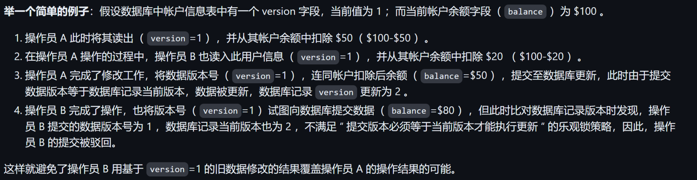


#### CAS算法实现


CAS全称为Compare And Swap (比较与交换),CAS的思想就是用一个预期值和要更新的变量值进行比较，两者相等才会进行更新。


CAS涉及的三个操作数：

> V要更新的变量值(Var)
>
> E 预期值(Expected)
>
> N拟写入的新值(New)

当且仅当V等于E时,CAS通过**原子方式**用新值N来更新V的值。

如果不等，说明其他线程更新的V，则当前线程放弃更新。


当多个线程同时使用CAS操作一个变量时，只会有一个胜出，并成功更新。其余的都会失败。失败的线程不会被挂起，会被告知失败，允许再次尝试，也允许失败的线程放弃操作。


CAS算法的ABA问题:

因为CAS操作比较的是V和E，如果在将V准备赋值成N的这段时间，其他线程修改了V的值然后又修改回原来的V值，此时CAS操作会误认为此值没有被修改过。

这就是CAS的ABA问题。


ABA的解决思路就是**在变量前追加版本号或者时间戳**。


CAS经常用到自旋操作来进行重试，也就是不成功一直循环直到成功。

解决:让JVM支持处理器提供pause指令。

pause指令能让自旋失败时，让cpu睡眠一小段时间再继续自旋。使读操作的频率降低，为解决内存顺序冲突而导致的CPU流水重排的代价也小很多。


CAS只能对单个共享变量有效，当涉及跨多个共享变量时，CAS无效。


## synchronized 

synchronized是Java的一个关键字，用来解决多个线程之间访问资源的同步性，可以保证被它修饰的方法或代码块才任意时刻只能有一个线程执行。


synchronized关键字的使用主要有下面3种:

1.修饰实例方法

2.修饰静态方法

3.修饰代码块


修饰实例方法是给当前对象加锁，进入同步代码前要先获得当前对象实例的锁。

修饰静态方法是给当前类加锁。会作用于类的所以实例，进入代码块前要先获得当前class的锁。


因为静态方法不属于任何一个实例对象，归属于整个类，不依赖类的特定实例，被类的所有实例共享。

静态synchronized方法和非静态的synchronized方法之间的调用不互斥。因为访问静态synchronized占用的是当前类的锁，而访问非静态synchronized方法占用的是当前实例对象的锁。


修改代码块锁的是括号内指定对象或者类、

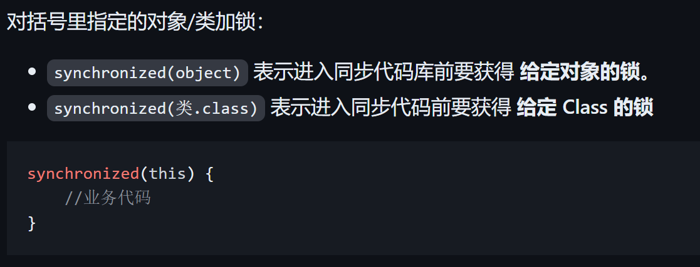


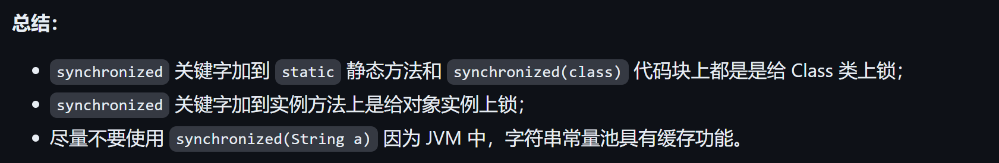


构造方法不能使用synchronized，但在构造方法内部可以使用。

构造方法本身就是线程安全的，但如果在构造方法内部对共享数据进行操作，

就需要采取适当的同步措施来保证整个构造过程是线程安全的。


##synchronized底层原理

synchronized同步语句块的情况：

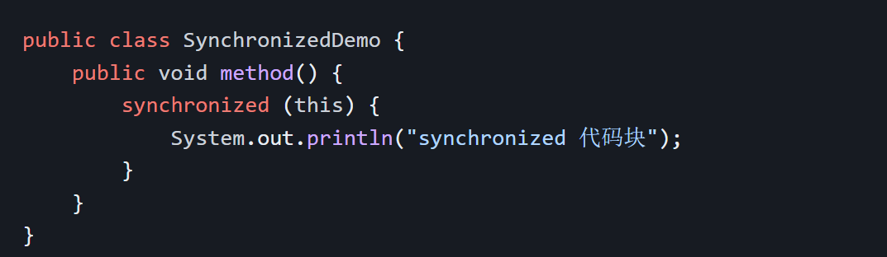

synchronized底层原理属于JVM的东西。

首先对Synchronized进行 javac 得到.class文件，然后执行


```
javap -c -s -v -l SynchronizedDemo.class
```


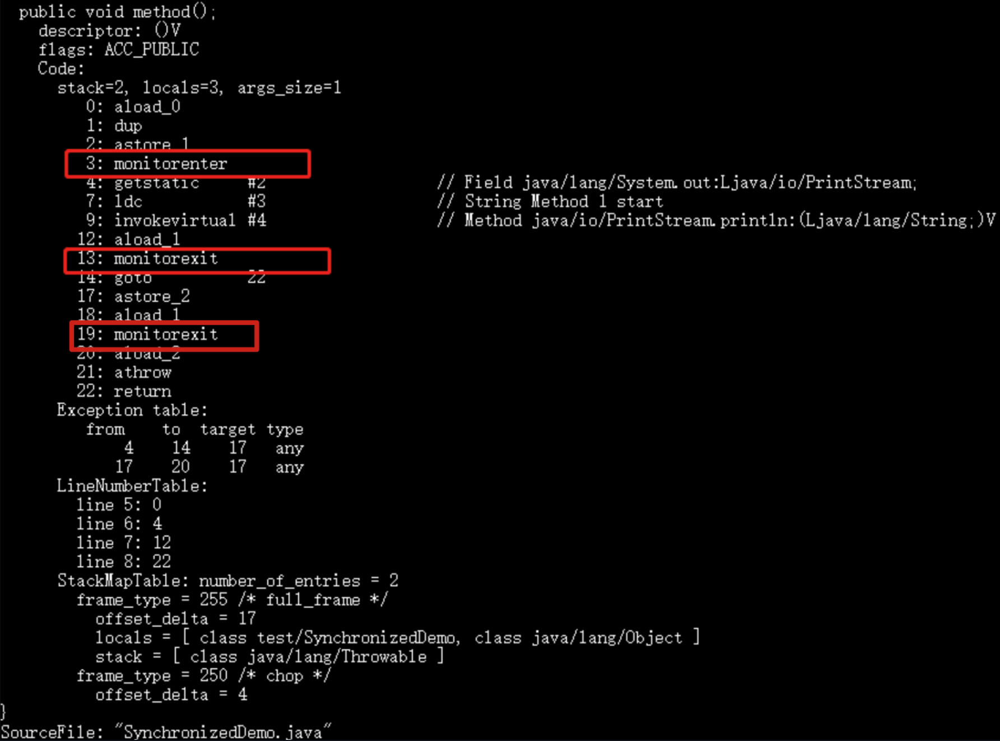

synch同步语句块是实现使用的monitorenter和monitorexit指令，monitorenter是同步代码块开始的位置，monitorexit指令则指明同步代码块的结束位置。

出现两个monitorexit指令是为了保证在同步代码块代码正确执行和出现异常的两种情况都能被正确的释放。


当执行monitorenter指令时，线程试图获取对象监视器monitor的特有权，也就是会尝试获取对象的锁，如果锁的计数器为0，则表示锁可以被获取，获取后将锁计数器设为1也就是加1。


对象锁的的拥有者线程才可以执行 `monitorexit` 指令来释放锁。在执行 `monitorexit` 指令后，将锁计数器设为 0，表明锁被释放，其他线程可以尝试获取锁。


如果获取对象锁失败，那当前线程就要阻塞等待，直到锁被另外一个线程释放为止。


synchronized修饰方法的情况

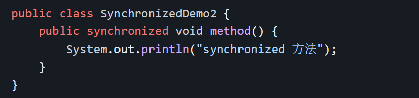


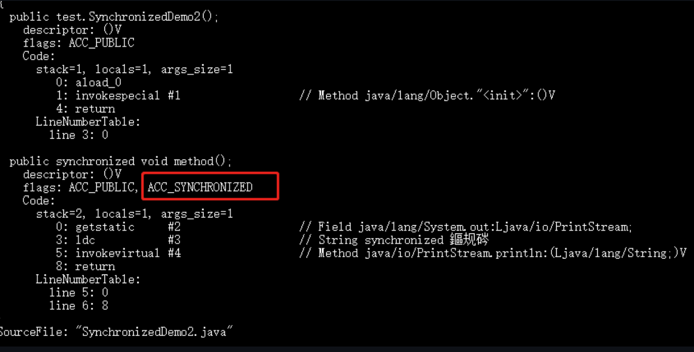

synchronized修饰方法并没有monitorenter指令和monitorexit指令，取而代之的是ACC_SYNCHRONIZED标识，用来指明该方法是一个同步方法，JVM通过这个标识来辨别方法是否声明为同步方法，从而执行相应的同步调用。


如果是实例方法，JVM会尝试获取对象的锁，如果是静态方法，会尝试获取当前class的锁。


总结：


synchronized同步语句块的实现是使用的monitorenter和monitorexit指令，其中monitorenter指令指明同步代码块的开始位置，monitorexit则指明同步代码块的结束位置。


synchronized修饰的方法并没有monitorenter指令和monitorexit指令，取而代之的是ACC_SYNCHRONIZED标识，指明了该方法为同步方法。


**但是两者的本质都是对对象监视器monitor的获取。**

## synchronized 和 volatile 有什么区别？

`synchronized` 关键字和 `volatile` 关键字是两个互补的存在，而不是对立的存在！

- `volatile` 关键字是线程同步的轻量级实现，所以 `volatile`性能肯定比`synchronized`关键字要好 。但是 `volatile` 关键字只能用于变量而 `synchronized` 关键字可以修饰方法以及代码块 。`
- ​
- `volatile` 关键字能保证数据的可见性，但不能保证数据的原子性。`synchronized` 关键字两者都能保证。
- ​
- `volatile`关键字主要用于解决变量在多个线程之间的可见性，而 `synchronized` 关键字解决的是多个线程之间访问资源的同步性。


## ThreadLocal

ThreadLocal用于保存某个线程共享变量：对于同一个static ThreadLocal，不同线程只能从中get，set，remove自己的变量，而不会影响其他线程的变量。


创建ThreadLocal变量,ThreadLocal.withInitial(() -> new ***());


### ThreadLocal原理


先从Thread类源码起：

```
public class Thread implements Runnable {
    //......
    //与此线程有关的ThreadLocal值。由ThreadLocal类维护
    ThreadLocal.ThreadLocalMap threadLocals = null;

    //与此线程有关的InheritableThreadLocal值。由InheritableThreadLocal类维护
    ThreadLocal.ThreadLocalMap inheritableThreadLocals = null;
    //......
}
```


Thread类中有一个threadLocals和一个inheritableThreadLocals变量，它们都是treadLocalMap类型的变量。默认情况下，它们都是null，只有当线程调用Thread类的set或get方法时才创建它们，实际上，当我们调用这两个方法的时候，我们调用的是ThreadLocalMap类对应的get和set方法。


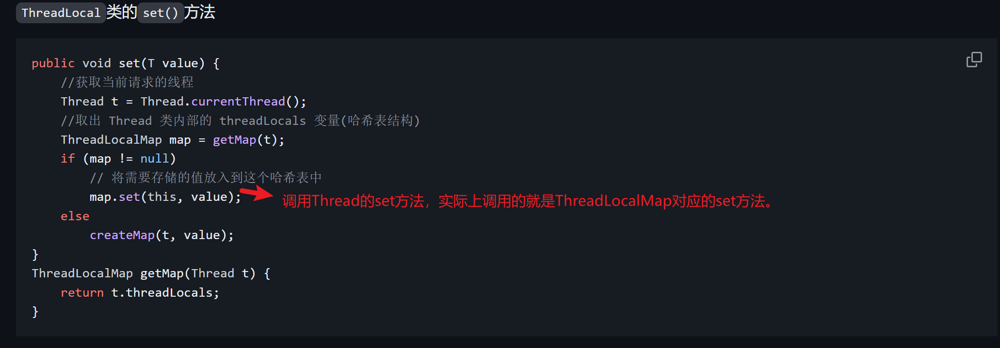


结论：最终的变量是放在当前线程的ThreadLocalMap上，ThreadLocal可以理解为ThreadLocal的封装，传递了变量值。ThreadLocal可以通过Thread.currentThread()来获取当前线程对象后，直接通过getMap(Thread t) 可以访问到该线程的ThreadLocalMap对象。


每一个Thread中都具备一个ThreadLocalMap，而ThreadLocal可以存储以ThreadLocal为key,Object对象为value的键值对。


### ThreadLocal 内存泄露问题是怎么导致的


ThreadLocalMap中使用的key为ThreadLocal的弱引用，而value是强引用，所以在GC的时候，key会被清理掉，而value会保留。从而出现内存泄漏。


解决：ThreadLocalMap实现中已经考虑这种情况，在调用set、get、remove方法的时候，会清理掉key为null的记录。

使用完ThreadLocal方法后最好手动调用remove方法。


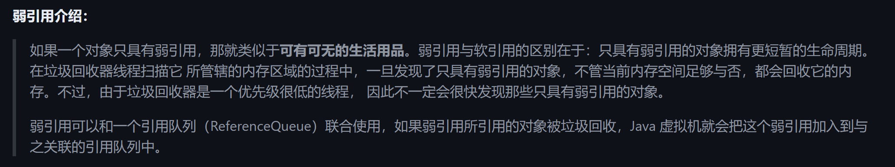


## 线程池

使用线程池的好处


> 降低资源消耗：通过重复利用已创建的线程降低线程创建和销毁所造成的消耗
>
> 提高响应速度：当任务到达时，任务可以不用等待线程创建就能立即执行。
>
> 提高线程的可管理性：线程是稀缺资源，如果无限制的创建，不仅会消耗系统资源，还会降低系统的稳定性，使用线程池可以进行统一的分配，调优和监控。


### 创建线程池

方式一：通过ThreadPoolExecutor构造函数来创建（推荐）

方式二：通过Executor框架的工具类Executors来创建。(在阿里巴巴开发规范手册不允许使用该方法创建线程池)


`Executors` 返回线程池对象的弊端如下：

- `FixedThreadPool` 和 `SingleThreadExecutor`:使用的是有界阻塞队列是 `LinkedBlockingQueue` ，其任务队列的最大长度为 `Integer.MAX_VALUE` ，可能堆积大量的请求，从而导致 OOM。
- `CachedThreadPool`:使用的是同步队列 `SynchronousQueue`, 允许创建的线程数量为 `Integer.MAX_VALUE` ，如果任务数量过多且执行速度较慢，可能会创建大量的线程，从而导致 OOM。
- `ScheduledThreadPool` 和 `SingleThreadScheduledExecutor` :使用的无界的延迟阻塞队列 `DelayedWorkQueue` ，任务队列最大长度为 `Integer.MAX_VALUE` ，可能堆积大量的请求，从而导致 OOM。


### THreadPoolExecutor参数

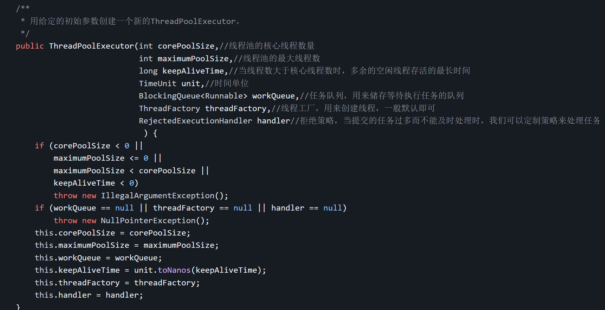

`ThreadPoolExecutor` 3 个最重要的参数：

- `corePoolSize` : 任务队列未达到队列容量时，最大可以同时运行的线程数量。
- `maximumPoolSize` : 任务队列中存放的任务达到队列容量的时候，当前可以同时运行的线程数量变为最大线程数。
- `workQueue`: 新任务来的时候会先判断当前运行的线程数量是否达到核心线程数，如果达到的话，新任务就会被存放在队列中。

`ThreadPoolExecutor`其他常见参数 :

- `keepAliveTime`:线程池中的线程数量大于 `corePoolSize` 的时候，如果这时没有新的任务提交，核心线程外的线程不会立即销毁，而是会等待，直到等待的时间超过了 `keepAliveTime`才会被回收销毁。
- `unit` : `keepAliveTime` 参数的时间单位。
- `threadFactory` :executor 创建新线程的时候会用到。
- `handler` :拒绝策略。


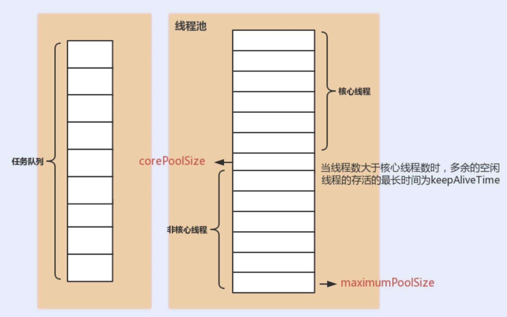


### 线程池的拒绝策略有哪些？

如果当前同时运行的线程数量达到最大线程数量并且队列也已经被放满了任务时，`ThreadPoolExecutor` 定义一些策略:

- `ThreadPoolExecutor.AbortPolicy`：抛出 `RejectedExecutionException`来拒绝新任务的处理。
- `ThreadPoolExecutor.CallerRunsPolicy`：调用执行自己的线程运行任务，也就是直接在调用`execute`方法的线程（主线程）中运行(`run`)被拒绝的任务，如果执行程序已关闭，则会丢弃该任务。因此这种策略会降低对于新任务提交速度，影响程序的整体性能。如果你的应用程序可以承受此延迟并且你要求任何一个任务请求都要被执行的话，你可以选择这个策略。
- `ThreadPoolExecutor.DiscardPolicy`：不处理新任务，直接丢弃掉。
- `ThreadPoolExecutor.DiscardOldestPolicy`：此策略将丢弃最早的未处理的任务请求。


如果任务不能丢弃，则使用CallerRunsPolicy策略。


### CallerRunsPolicy 拒绝策略有什么风险？如何解决？


`CallerRunsPolicy`的任务是个非常耗时的任务，且处理提交任务的线程是主线程，可能会导致主线程阻塞，影响程序的正常运行。

例子：

```
public class ThreadPoolTest {

    private static final Logger log = LoggerFactory.getLogger(ThreadPoolTest.class);

    public static void main(String[] args) {
        // 创建一个线程池，核心线程数为1，最大线程数为2
        // 当线程数大于核心线程数时，多余的空闲线程存活的最长时间为60秒，
        // 任务队列为容量为1的ArrayBlockingQueue，饱和策略为CallerRunsPolicy。
        ThreadPoolExecutor threadPoolExecutor = new ThreadPoolExecutor(1,
                2,
                60,
                TimeUnit.SECONDS,
                new ArrayBlockingQueue<>(1),
                new ThreadPoolExecutor.CallerRunsPolicy());

        // 提交第一个任务，由核心线程执行
        threadPoolExecutor.execute(() -> {
            log.info("核心线程执行第一个任务");
            ThreadUtil.sleep(1, TimeUnit.MINUTES);
        });

        // 提交第二个任务，由于核心线程被占用，任务将进入队列等待
        threadPoolExecutor.execute(() -> {
            log.info("非核心线程处理入队的第二个任务");
            ThreadUtil.sleep(1, TimeUnit.MINUTES);
        });

        // 提交第三个任务，由于核心线程被占用且队列已满，创建非核心线程处理
        threadPoolExecutor.execute(() -> {
            log.info("非核心线程处理第三个任务");
            ThreadUtil.sleep(1, TimeUnit.MINUTES);
        });

        // 提交第四个任务，由于核心线程和非核心线程都被占用，队列也满了，根据CallerRunsPolicy策略，任务将由提交任务的线程（即主线程）来执行
        threadPoolExecutor.execute(() -> {
            log.info("主线程处理第四个任务");
            ThreadUtil.sleep(2, TimeUnit.MINUTES);
        });

        // 提交第五个任务，主线程被第四个任务卡住，该任务必须等到主线程执行完才能提交
        threadPoolExecutor.execute(() -> {
            log.info("核心线程执行第五个任务");
        });

        // 关闭线程池
        threadPoolExecutor.shutdown();
    }
}

```


输出：

```
18:19:48.203 INFO  [pool-1-thread-1] c.j.concurrent.ThreadPoolTest - 核心线程执行第一个任务
18:19:48.203 INFO  [pool-1-thread-2] c.j.concurrent.ThreadPoolTest - 非核心线程处理第三个任务
18:19:48.203 INFO  [main] c.j.concurrent.ThreadPoolTest - 主线程处理第四个任务
18:20:48.212 INFO  [pool-1-thread-2] c.j.concurrent.ThreadPoolTest - 非核心线程处理入队的第二个任务
18:21:48.219 INFO  [pool-1-thread-2] c.j.concurrent.ThreadPoolTest - 核心线程执行第五个任务
```

从输出结果可以看出，因为`CallerRunsPolicy`这个拒绝策略，导致耗时的任务用了主线程执行，导致线程池阻塞，进而导致后续任务无法及时执行，严重的情况下很可能导致 OOM。


如何解决：(调整队列大小和最大线程池数)

在内存允许的情况下，我们可以增加阻塞队列`BlockingQueue`的大小并调整堆内存以容纳更多的任务，确保任务能够被准确执行。

为了充分利用 CPU，我们还可以调整线程池的`maximumPoolSize` （最大线程数）参数，这样可以提高任务处理速度，避免累计在 `BlockingQueue`的任务过多导致内存用完。


如果服务器资源以达到可利用的极限，这就意味我们要在设计策略上改变线程池的调度了.

这里提供的一种**任务持久化**的思路，这里所谓的任务持久化，包括但不限于:

1. 设计一张任务表间任务存储到 MySQL 数据库中。
2. Redis 缓存任务。
3. 将任务提交到消息队列中。


### 线程池常用的阻塞队列有哪些？


1.容量为Integer.MAX_VALUE的LinkBlockingQueue(有界阻塞队列)：FixedThreadPool、SingleThreadExecutor。

FixedThreadPool的核心线数等于最大线程数。

SingleThreadExecutor只能创建一个线程(核心线数等于最大线程数=1)


2.SynchronousQueue(同步队列): CachedThreadPool。

SynchronousQueue没有容量，不存储元素，目的是保证对于提交的任务，如果有空闲的线程，则使用空闲的线程来处理，否则创建一个新线程处理任务。

So,CachedThreadPool最大线程数是Integer.MAX_VALUE，线程数可以无限扩展，有OOM风险。

3.DelayedWorkQueue(延迟队列): ScheduledThreadPool和SingleThreadScheduledExecutor。

DelayedWorkQueue内部采用堆的数据结构。不是按照放入时间排序，而是会按照延迟的时间长短堆任务进行排序，可以保证每次出队的任务都是当前队列中执行时间最靠前的。DelayedWorkQueue会自动扩容，增加到原来的50%，不会阻塞，最大扩容Integer.MAX_VALUE。

4.ArrayBlockingQueue(有界阻塞队列): 底层由数组实现，容量一旦创建，就不能修改。


### 线程池处理流程

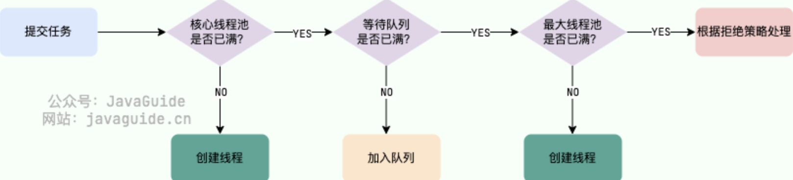

1. 如果当前运行的线程数小于核心线程数，那么就会新建一个线程来执行任务。
2. 如果当前运行的线程数等于或大于核心线程数，但是小于最大线程数，那么就把该任务放入到任务队列里等待执行。
3. 如果向任务队列投放任务失败（任务队列已经满了），但是当前运行的线程数是小于最大线程数的，就新建一个线程来执行任务。
4. 如果当前运行的线程数已经等同于最大线程数了，新建线程将会使当前运行的线程超出最大线程数，那么当前任务会被拒绝，拒绝策略会调用`RejectedExecutionHandler.rejectedExecution()`方法。


### 线程池中线程异常后，销毁还是复用


分为两种：如果使用的是execute()时，未捕获异常导致线程终止，线程池会创建新线程替代。

如果使用的是submit()时，异常被封装到Future中，线程继续复用。


所以，submit()提供更灵活的错误处理机制，因为它允许调用者决定如何处理异常，而execute()则适用于那些不需要关注执行结果的场景。


### 如何设定线程池的大小


有一个简单并且适用面比较广的公式：

- **CPU 密集型任务(N+1)：** 这种任务消耗的主要是 CPU 资源，可以将线程数设置为 N（CPU 核心数）+1。比 CPU 核心数多出来的一个线程是为了防止线程偶发的缺页中断，或者其它原因导致的任务暂停而带来的影响。一旦任务暂停，CPU 就会处于空闲状态，而在这种情况下多出来的一个线程就可以充分利用 CPU 的空闲时间。
- **I/O 密集型任务(2N)：** 这种任务应用起来，系统会用大部分的时间来处理 I/O 交互，而线程在处理 I/O 的时间段内不会占用 CPU 来处理，这时就可以将 CPU 交出给其它线程使用。因此在 I/O 密集型任务的应用中，我们可以多配置一些线程，具体的计算方法是 2N。


CPU 密集型简单理解就是利用 CPU 计算能力的任务比如你在内存中对大量数据进行排序。但凡涉及到网络读取，文件读取这类都是 IO 密集型，这类任务的特点是 CPU 计算耗费时间相比于等待 IO 操作完成的时间来说很少，大部分时间都花在了等待 IO 操作完成上。


线程数更严谨的计算的方法应该是：`最佳线程数 = N（CPU 核心数）∗（1+WT（线程等待时间）/ST（线程计算时间））`，其中 `WT（线程等待时间）=线程运行总时间 - ST（线程计算时间）`。

线程等待时间所占比例越高，需要越多线程。线程计算时间所占比例越高，需要越少线程。


### 如何设计一个能够根据任务的优先级来执行的线程池


使用 `PriorityBlockingQueue` （优先级阻塞队列）作为任务队列（`ThreadPoolExecutor` 的构造函数有一个 `workQueue` 参数可以传入任务队列）。

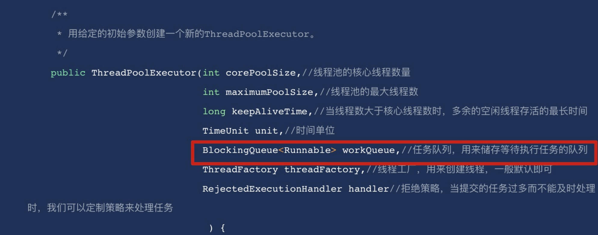


`PriorityBlockingQueue` 是一个支持优先级的无界阻塞队列，可以看作是线程安全的 `PriorityQueue`，两者底层都是使用小顶堆形式的二叉堆，即值最小的元素优先出队。不过，`PriorityQueue` 不支持阻塞操作。


要想让 `PriorityBlockingQueue` 实现对任务的排序，传入其中的任务必须是具备排序能力的，方式有两种：

1. 提交到线程池的任务实现 `Comparable` 接口，并重写 `compareTo` 方法来指定任务之间的优先级比较规则。
2. 创建 `PriorityBlockingQueue` 时传入一个 `Comparator` 对象来指定任务之间的排序规则(推荐)。


不过，这存在一些风险和问题，比如：

- `PriorityBlockingQueue` 是无界的，可能堆积大量的请求，从而导致 OOM。
- 可能会导致饥饿问题，即低优先级的任务长时间得不到执行。
- 由于需要对队列中的元素进行排序操作以及保证线程安全（并发控制采用的是可重入锁 `ReentrantLock`），因此会降低性能。

对于 OOM 这个问题的解决比较简单粗暴，就是继承`PriorityBlockingQueue` 并重写一下 `offer` 方法(入队)的逻辑，当插入的元素数量超过指定值就返回 false 。

饥饿问题这个可以通过优化设计来解决（比较麻烦），比如等待时间过长的任务会被移除并重新添加到队列中，但是优先级会被提升。

对于性能方面的影响，是没办法避免的，毕竟需要对任务进行排序操作。并且，对于大部分业务场景来说，这点性能影响是可以接受的。


## Future

`Future` 类是异步思想的典型运用，主要用在一些需要执行耗时任务的场景,避免程序一直原地等待耗时任务执行完成，执行效率太低。

当我们执行某一耗时的任务时，可以将这个耗时任务交给一个子线程去异步执行，同时我们可以干点其他事情，不用傻傻等待耗时任务执行完成。等我们的事情干完后，我们再通过 `Future` 类获取到耗时任务的执行结果。这样一来，程序的执行效率就明显提高了。


## AQS

AQS 的全称为 `AbstractQueuedSynchronizer` ，翻译过来的意思就是抽象队列同步器。这个类在 `java.util.concurrent.locks` 包下面。


AQS 为构建锁和同步器提供了一些通用功能的实现，因此，使用 AQS 能简单且高效地构造出应用广泛的大量的同步器，比如我们提到的 `ReentrantLock`，`Semaphore`，其他的诸如 `ReentrantReadWriteLock`，`SynchronousQueue`等等皆是基于 AQS 的。


### AQS 的原理

AQS 核心思想是，如果被请求的共享资源空闲，则将当前请求资源的线程设置为有效的工作线程，并且将共享资源设置为锁定状态。如果被请求的共享资源被占用，那么就需要一套线程阻塞等待以及被唤醒时锁分配的机制，这个机制 AQS 是用 **CLH 队列锁** 实现的，即将暂时获取不到锁的线程加入到队列中。


CLH(Craig,Landin,and Hagersten) 队列是一个虚拟的双向队列（虚拟的双向队列即不存在队列实例，仅存在结点之间的关联关系）。AQS 是将每条请求共享资源的线程封装成一个 CLH 锁队列的一个结点（Node）来实现锁的分配。在 CLH 同步队列中，一个节点表示一个线程，它保存着线程的引用（thread）、 当前节点在队列中的状态（waitStatus）、前驱节点（prev）、后继节点（next）。

CLH 队列结构如下图所示：


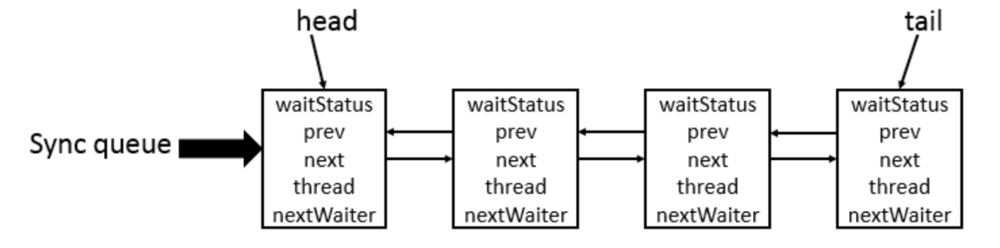


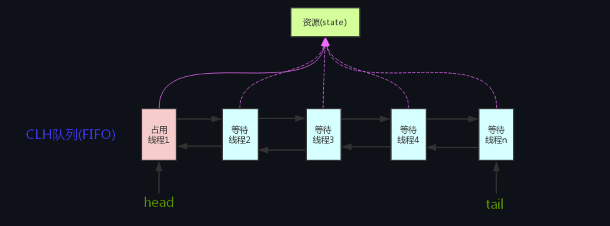


AQS 使用 **int 成员变量 state 表示同步状态**，通过内置的 **线程等待队列** 来完成获取资源线程的排队工作。

`state` 变量由 `volatile` 修饰，用于展示当前临界资源的获锁情况。


```
// 共享变量，使用volatile修饰保证线程可见性
private volatile int state;
```


