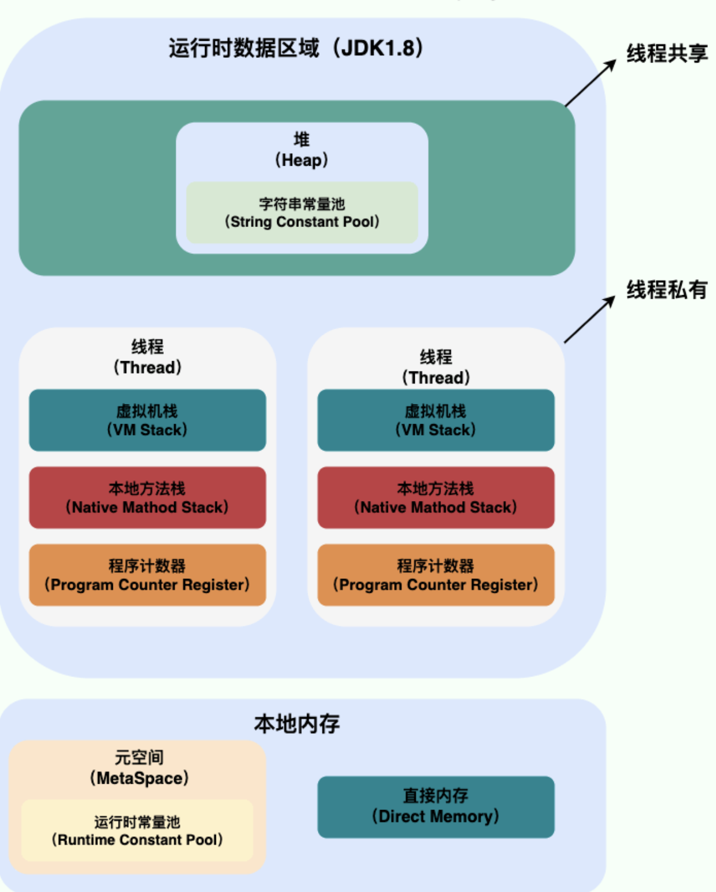
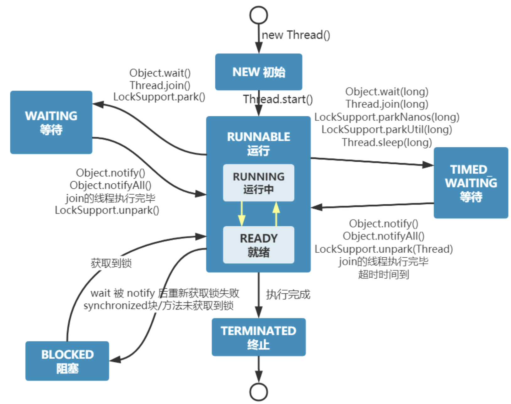
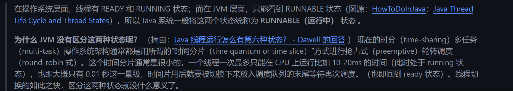

# Java并发

## 线程与进程

进程是程序的一次执行过程，是系统运行程序的基本单位。

而线程与进程相似，但线程是一个比进程更小的执行单位。一个进程在执行的过程中可以产生多个线程。

与进程不同的是**同类的多个线程共享**进程的堆和方法区资源。但每个线程都有自己的程序计数器、虚拟机栈和本地方法栈。

线程称为轻量级的进程。（负担要比进程小得多）

## 简要描述线程与进程的关系、区别及优缺点

上图为Java内存区域，我们从 JVM 的角度来说一下线程和进程之间的关系。

一个进程有多个线程，多个线程共享进程中的堆和方法区资源(元空间)，但每个线程都会有自己的程序计数器、虚拟机栈和本地方法栈。

**线程是进程划分成的更小的运行单位。线程和进程最大的不同在于基本上各进程是独立的，而各线程则不一定，因为同一进程中的线程极有可能会相互影响。线程执行开销小，但不利于资源的管理和保护；而进程正相反。**

为什么程序计数器私有?

程序计数器主要有下面两个作用：

1. 字节码解释器通过改变程序计数器来依次读取指令，从而实现代码的流程控制，如：顺序执行、选择、循环、异常处理。
2. 在多线程的情况下，程序计数器用于记录当前线程执行的位置，从而当线程被切换回来的时候能够知道该线程上次运行到哪儿了。

程序计数器私有主要是为了**线程切换后能恢复到正确的执行位置**。

虚拟机栈和本地方法栈为什么是私有的?

为了**保证线程中的局部变量不被别的线程访问到**

堆和方法区是所有线程共享的资源，其中堆是进程中最大的一块内存，主要用于存放新创建的对象 (几乎所有对象都在这里分配内存)，方法区主要用于存放已被加载的类信息、常量、静态变量、即时编译器编译后的代码等数据。

## 如何创建线程

一般来说，创建线程有很多种方式，例如继承`Thread`类、实现`Runnable`接口、实现`Callable`接口、使用线程池、使用`CompletableFuture`类等等。

不过，这些方式其实并没有真正创建出线程。准确点来说，这些都属于是在 Java 代码中使用多线程的方法。

严格来说，Java 就只有一种方式可以创建线程，那就是通过`new Thread().start()`创建。不管是哪种方式，最终还是依赖于`new Thread().start()`。

详解:https://mp.weixin.qq.com/s/NspUsyhEmKnJ-4OprRFp9g

## 线程的上下文切换

上下文是指线程执行过程中的状态和运行条件。

- 主动让出 CPU，比如调用了 `sleep()`, `wait()` 等。
- 时间片用完，因为操作系统要防止一个线程或者进程长时间占用 CPU 导致其他线程或者进程饿死。
- 调用了阻塞类型的系统中断，比如请求 IO，线程被阻塞。

这三种都会发生线程切换，线程切换意味着需要保存当前线程的上下文，留待线程下次占用 CPU 的时候恢复现场。并加载下一个将要占用 CPU 的线程上下文。这就是所谓的 上下文切换。

## 可以直接调用 Thread 类的 run 方法吗？

new 一个Thread，线程进入了新建状态，调用start()方法，会启动一个线程并使线程进入了就绪状态。当分配到时间片后就可以开始运行了。start()会执行线程的相应准备工作，然后自动执行run()方法的内容。这是真正多线程工作。而直接执行run()方法，会把run()方法当成一个main线程下的普通方法去执行，并不会在某个线程中执行它，所以这不是多线程执行。

**总结：调用start()方法可启动线程并使线程进入就绪状态，直接执行run()方法的话不会以多线程的方式执行。**

## 线程的生命周期

线程在生命周期中并不是固定处于某种状态而是随着代码的执行在不同状态之间切换。

> NEW:初始状态，线程被创建出来但没有被调用start().
>
> RUNNABLE:运行状态，线程被调用start()等待运行的状态。
>
> BLOCKED:阻塞状态，需要等待锁释放。
>
> WAITING:等待状态，表示该线程需要等待其他线程做出一些特定的动作。
>
> TIME_WAITING:超时等待状态:在制定时间后自行返回而不像WAITING那样一直等待。
>
> TERMINATED:终止状态，表示该线程已经运行完毕。

线程创建之后他将处于NEW状态，调用start()方法后开始运行，线程这时处于READY状态，可运行状态的线程获得了CPU(timeslice)后就处于RUNNING状态。

## 乐观锁和悲观锁

**悲观锁**:悲观锁总是假设最坏的情况(认为只要访问就会出现问题)，所以每次获取资源操作的时候都会上锁，其他线程想要拿到这个资源就会阻塞直到锁被上一个持有者释放。

悲观锁也就是共享资源每次只分给一个线程使用，其他线程阻塞，用完再把资源转让给其他线程。

例如java中synchronized和ReentrantLock 等独占锁就是悲观锁思想的实现。

高并发的场景下，锁竞争会造成线程阻塞，大量的阻塞线程会导致系统的上下文切换，增加系统性能开销。而且悲观锁还会有死锁问题，影响代码的执行。

**乐观锁**: 乐观锁总是假设最好的情况，认为共享资源每次被访问的时候不会出现问题，线程可以不停的执行。无需加锁也无需等待。只是在提交修改的时候去验证对应资源是否被其他线程修改了。

高并发的场景下，乐观锁相比悲观锁来说，不存在锁竞争造成线程阻塞，也不会有死锁的问题，在性能上往往会更胜一筹。但是，如果冲突频繁发生（写占比非常多的情况），会频繁失败和重试，这样同样会非常影响性能，导致 CPU 飙升。

理论上来说：

- 悲观锁通常多用于写比较多的情况（多写场景，竞争激烈），这样可以避免频繁失败和重试影响性能，悲观锁的开销是固定的。不过，如果乐观锁解决了频繁失败和重试这个问题的话（比如`LongAdder`），也是可以考虑使用乐观锁的，要视实际情况而定。
- 乐观锁通常多用于写比较少的情况（多读场景，竞争较少），这样可以避免频繁加锁影响性能。不过，乐观锁主要针对的对象是单个共享变量（参考`java.util.concurrent.atomic`包下面的原子变量类）。

### 实现乐观锁

