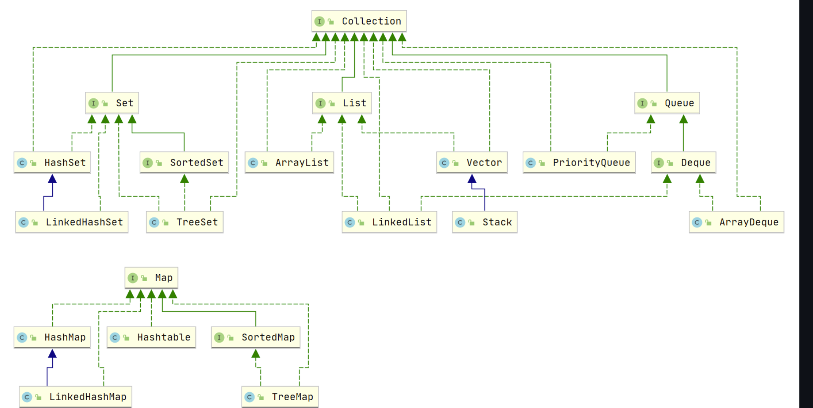
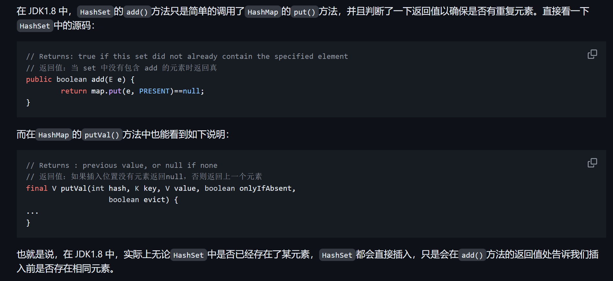
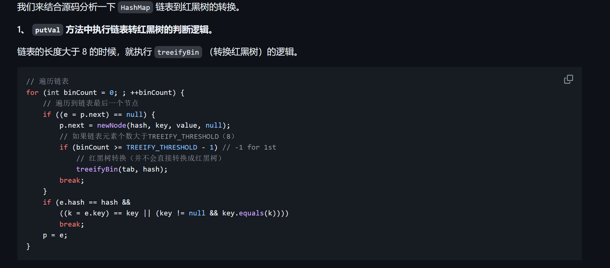
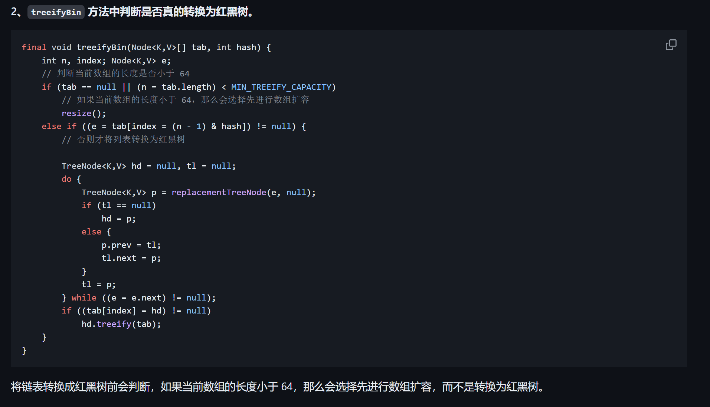

# Java集合

java集合框架



## List, Set, Queue, Map区别

1.List存储元素有序可重复。

2.Set存储元素无序不可重复。

3.Queue按特定的排序规则确定先后顺序，有序可重复。

4.Map存储的是键值对，key无序不可重复，value无序可重复。一个键只映射到一个值。


## LinkedList 为什么不能实现 RandomAccess 接口？

LinkedList底层的数据结构是链表，内存地址不连续，只能通过指针定位，不支持随机访问。

> RandomAccess(随机访问)指通过索引下标可以快速的访问元素,它是一个标识，来表示实现它的类支持随机访问。


## ArrayList和LinkedList的区别


1.线程安全：ArrayList和LinkedList 都是不同步的，都是线程不安全的。

2.数据结构: ArrayList 是Object[] 数组实现的，而LinkedList 是由双向链表实现的。

3.随机访问：ArrayList底层实现了RandomAccess，支持随机访问，LinkedList 不支持随机访问。

4.内存占用: LinkedList的每个元素占用的内存都比ArrayList大(因为要存储前驱和后继结点的指针),而ArrayList的内存占用体现在列表的结尾会预留一些空间。


## Comparable和Comparator的区别

Comparable接口和Comparator都是Java中用于排序的接口，在实现类对象之间比较大小有重要作用。


Comparable接口出自java.lang包，它有一个compareTo(Object obj) 的方法来排序。

Comparator接口出自java.util包，它有一个compare(Object obj, Objcet obj2)方法来排序。


一般对一个集合使用自定义排序时，我们就需要重写compareTo()方法或compare()方法。当我们需要对一个集合实现两种排序方式，我们可以重写compareTo()方法和使用自制的Comparator方法或者以两个Comparator来实现排序。第二种代表我们只能使用两个参数版的Collections.sort()。


##HashMap和HashTable的区别


1.线程安全
HashMap是非线程安全的，而HashTable内部基本都经过synchronized修饰，所以线程安全。

2.效率

由于线程安全，所以HashMap的效率高于HashTable，HashTable基本淘汰，不要使用。

3.扩容

HashMap默认初始化大小为16,之后每次扩容，容量变为原来的2倍。

HashTable初始化大小为11,扩容为原来的2n+1。

如果给定了初始大小，Hashtable会直接使用给定的大小，而HashMap会扩容为2的幂次方大小。

4.底层数据结构

HashMap在解决哈希冲突时，在JDK1.8有了较大的变化，当链表长度大于阈值时(默认为8),会将链表转化为红黑树(在转变成红黑树前也会判断当前数组长度，如果小于64,则会对数组扩容，而不是转化成红黑树)来减少搜索时间。

HashTable没有这个机制。


## HashMap和HashSet

`HashSet` 底层就是基于 `HashMap` 实现的。（`HashSet` 的源码非常非常少，因为除了 `clone()`、`writeObject()`、`readObject()`是 `HashSet` 自己不得不实现之外，其他方法都是直接调用 `HashMap` 中的方法。


| `HashMap`                              | `HashSet`                                                    |
| -------------------------------------- | ------------------------------------------------------------ |
| 实现了 `Map` 接口                      | 实现 `Set` 接口                                              |
| 存储键值对                             | 仅存储对象                                                   |
| 调用 `put()`向 map 中添加元素          | 调用 `add()`方法向 `Set` 中添加元素                          |
| `HashMap` 使用键（Key）计算 `hashcode` | `HashSet` 使用成员对象来计算 `hashcode` 值，对于两个对象来说 `hashcode` 可能相同，所以`equals()`方法用来判断对象的相等性 |


## HashSet如何进行检查重复


在向HashSet添加对象时，HashSet会先计算出对象的hashcode来判断加入的位置，同时也会与其他加入的对象的hashcode进行判断,如果没用相同的hashcode，则认为没用重复。如果hashcode相同，则会调用equal()方法来判断hashcode相同的对象是否真的相同。如果相同，则不会让其添加成功。




## HashMap的底层实现


JDK1.8之前

 `HashMap` 底层是 **数组和链表** 结合在一起使用也就是 **链表散列**。HashMap 通过 key 的 `hashcode` 经过扰动函数处理过后得到 hash 值，然后通过 `(n - 1) & hash` 判断当前元素存放的位置（这里的 n 指的是数组的长度），如果当前位置存在元素的话，就判断该元素与要存入的元素的 hash 值以及 key 是否相同，如果相同的话，直接覆盖，不相同就通过拉链法解决冲突。

所谓扰动函数指的就是 HashMap 的 `hash` 方法。使用 `hash` 方法也就是扰动函数是为了防止一些实现比较差的 `hashCode()` 方法 换句话说使用扰动函数之后可以减少碰撞。

所谓 **“拉链法”** 就是：将链表和数组相结合。也就是说创建一个链表数组，数组中每一格就是一个链表。若遇到哈希冲突，则将冲突的值加到链表中即可。


JDK1.8之后

相比于之前的版本， JDK1.8 之后在解决哈希冲突时有了较大的变化，当链表长度大于阈值（默认为 8）（将链表转换成红黑树前会判断，如果当前数组的长度小于 64，那么会选择先进行数组扩容，而不是转换为红黑树）时，将链表转化为红黑树，以减少搜索时间。







## 为什么HashMap的大小为2的幂次方


为了在计算索引时使用更**高效的位运算**，减少哈希冲突。


为了能让 HashMap 存取高效，尽量较少碰撞，也就是要尽量把数据分配均匀。Hash 值的范围值-2147483648 到 2147483647，前后加起来大概 40 亿的映射空间，只要哈希函数映射得比较均匀松散，一般应用是很难出现碰撞的。但问题是一个 40 亿长度的数组，内存是放不下的。所以这个散列值是不能直接拿来用的。用之前还要先做对数组的长度取模运算，得到的余数才能用来要存放的位置也就是对应的数组下标。这个数组下标的计算方法是“ `(n - 1) & hash`”。（n 代表数组长度）。

**取余(%)操作中如果除数是 2 的幂次则等价于与其除数减一的与(&)操作（也就是说 hash%length==hash&(length-1)的前提是 length 是 2 的 n 次方；）。”** 并且 **采用二进制位操作 &，相对于%能够提高运算效率，这就解释了 HashMap 的长度为什么是 2 的幂次方。**

## ConcurrentHashMap 和 Hashtable区别

- **底层数据结构：** JDK1.7 的 `ConcurrentHashMap` 底层采用 **分段的数组+链表** 实现，JDK1.8 采用的数据结构跟 `HashMap1.8` 的结构一样，数组+链表/红黑二叉树。`Hashtable` 和 JDK1.8 之前的 `HashMap` 的底层数据结构类似都是采用 **数组+链表** 的形式，数组是 HashMap 的主体，链表则是主要为了解决哈希冲突而存在的；
- **实现线程安全的方式（重要）:**
- Hashtable：通过对每个方法进行同步实现线程安全(同步关键字 (`synchronized`) )简单但性能较低，适用于低并发场景。
- **ConcurrentHashMap**：通过分段锁（JDK 7 及之前）或 CAS 操作和细粒度锁（JDK 8 及之后）实现高效的线程安全，适用于高并发场景。它极大地减少了锁的竞争，提高了并发性能。
- `ConcurrentHashMap` 取消了 `Segment` 分段锁，采用 `Node + CAS + synchronized` 来保证并发安全。


在 JDK 8 之后，`ConcurrentHashMap` 进一步优化，移除了分段锁，改用一种更细粒度的锁机制。它使用了 `CAS`（Compare-And-Swap）操作来实现无锁的并发控制，对于某些操作（例如读取操作），完全不需要锁。

对于写入操作，`ConcurrentHashMap` 使用一种基于节点的锁机制。每个桶（bucket）或树节点在需要时会进行同步，从而允许更细粒度的锁定。

对于大多数读取操作，`ConcurrentHashMap` 采用无锁策略，直接通过 `volatile` 变量保证可见性，极大地提高了读取操作的性能。

## 集合使用的注意事项


1.**判断所有集合内部的元素是否为空，使用 isEmpty() 方法**


### 集合转Map

2.**在使用 java.util.stream.Collectors 类的 toMap() 方法转为 Map 集合时，一定要注意当 value 为 null 时会抛 NPE 异常。**


### 集合转数组

3.**使用集合转数组的方法，必须使用集合的 toArray(T[] array)，传入的是类型完全一致、长度为 0 的空数组。**

由于 JVM 优化，`new String[0]`作为`Collection.toArray()`方法的参数现在使用更好，`new String[0]`就是起一个模板的作用，指定了返回数组的类型，0 是为了节省空间，因为它只是为了说明返回的类型。


### 数组转集合

**使用工具类 Arrays.asList() 把数组转换成集合时，不能使用其修改集合相关的方法， 它的 add/remove/clear 方法会抛出 UnsupportedOperationException 异常。**


`Arrays.asList()` 方法返回的并不是 `java.util.ArrayList` ，而是 `java.util.Arrays` 的一个内部类,这个内部类并没有实现集合的修改方法或者说并没有重写这些方法。


**如何正确的将数组转换为 ArrayList ?**

1.最简便的方法

```
List list = new ArrayList<>(Arrays.asList("a", "b", "c"))
```


2.、使用 Java8 的 `Stream`(推荐)

```
Integer [] myArray = { 1, 2, 3 };
List myList = Arrays.stream(myArray).collect(Collectors.toList());
//基本类型也可以实现转换（依赖boxed的装箱操作）
int [] myArray2 = { 1, 2, 3 };
List myList = Arrays.stream(myArray2).boxed().collect(Collectors.toList());
```

